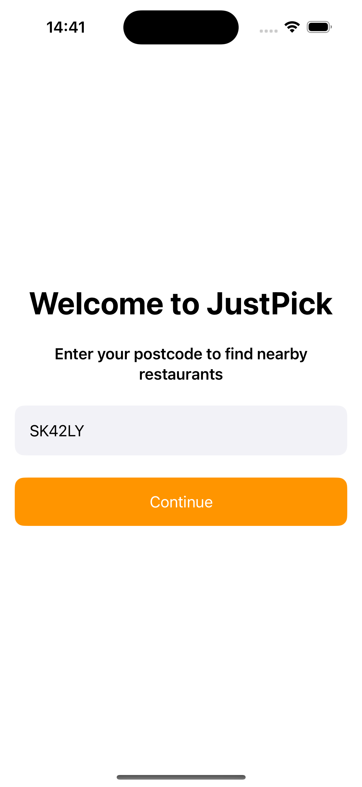
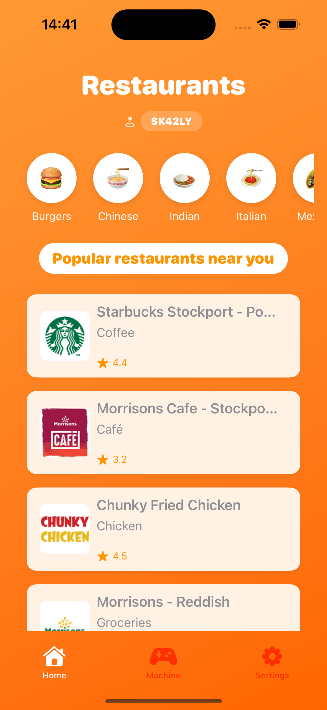
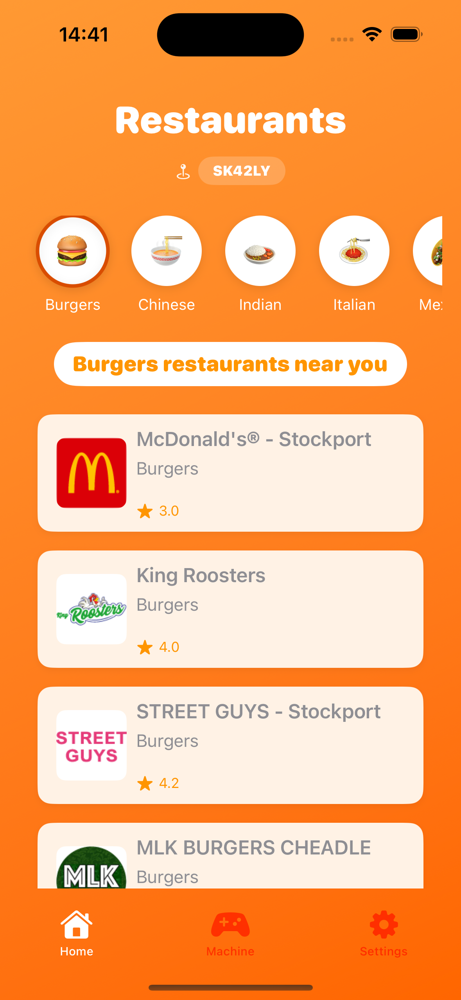
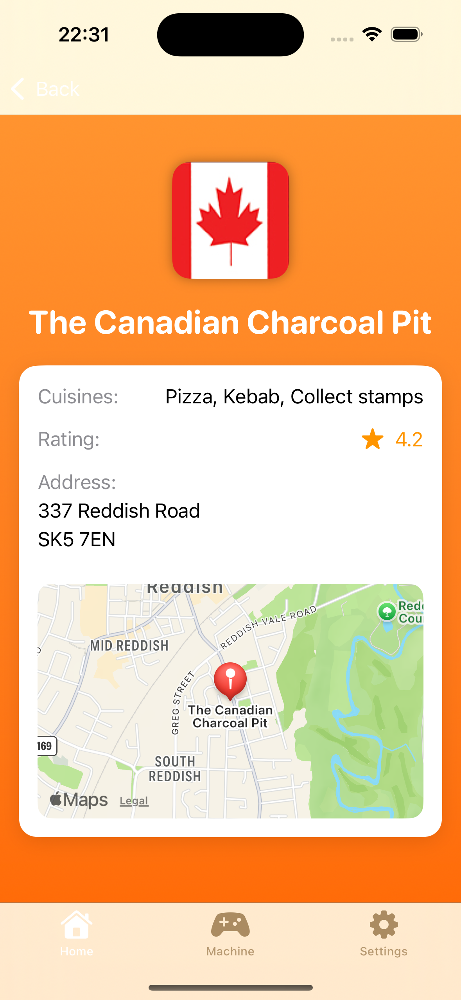
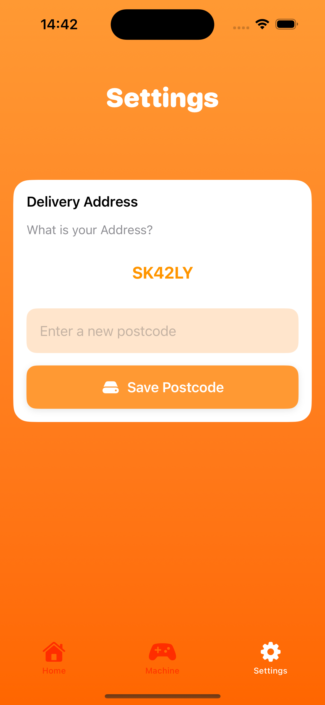
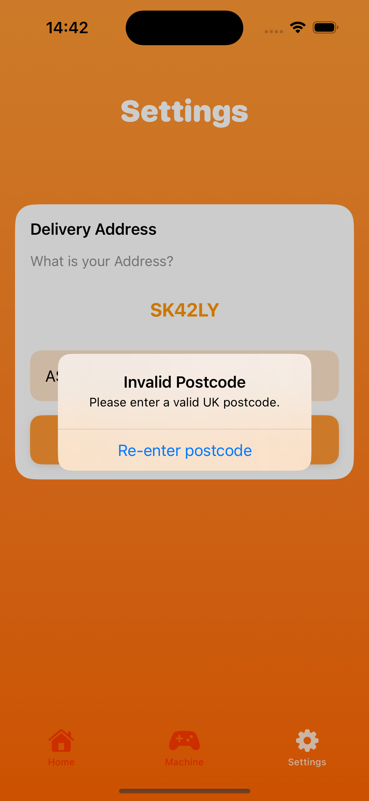

# JustEatTakeaway iOS Coding Assignment

This is my solution for the Early Careers Mobile Engineering Program iOS Coding Assignment. The app fetches and displays restaurant data based on a UK postcode using the Just Eat API. All code written was made using Swift.

## Images from simulator


<table>
  <tr>
    <td align="center">
      <br>
      <sub><b>1. Launch Screen</b></sub>
    </td>
    <td align="center">
      <br>
      <sub><b>2. Home View</b></sub>
    </td>
    <td align="center">
      <br>
      <sub><b>3. Cuisine types</b></sub>
    </td>
    <td align="center">
      <br>
      <sub><b>4. Restaurant Details</b></sub>
    </td>
    <td align="center">
      <br>
      <sub><b>5. Random Machine View</b></sub>
    </td>
    <td align="center">
      <br>
      <sub><b>6. Settings View</b></sub>
    </td>
    <td align="center">
      <br>
      <sub><b>7. Invalid postcode View</b></sub>
    </td>
  </tr>
</table>


## Features

### 1. Onboarding screen for the application

- This is where new users can input their location so the app can fetch the nearest restaurants to them using the Just Eat API

### 2. Home View based on postcode

- View restaurants that are currently open for delivery
- See restaurant details including ratings, cuisine types, and addresses
- Sort restaurants by category of cuisine
- Each restaurant card contains the name, main cuisine type, logo and rating 

### 3. Restaurant Details
- Detailed view of each restaurant including:
  - Restaurant logo
  - Rating and reviews
  - Cuisine type list from API
  - Full address
  - Interactive map view of restaurant location

### 4. Fun Features
- Food Slot Machine feature for random cuisine selection
- The restaurants are returned for that type of cuisine from the slot machine
- Added confetti effects for enhanced user experience

### 5. Settings
- Update your postcode
- Postcode validation (Works for UK postcodes but sometimes accepts invalid postcodes)

## Getting Started

### Prerequisites
- Xcode 15.0 or later
- iOS 16.0 or later for running on device

### Installation Steps
1. Open Terminal on your Mac
2. Clone the repository:
   ```bash
   git clone https://github.com/joseseyah/JustEatAssessment2025
   cd JustEatAssessment2025
   ```
3. Open the project in Xcode:
   ```bash
   cd JustEat/
   open JustEat.xcodeproj
   ```

### Running the App
1. In Xcode, select your target device simulator will work
2. Click the "Run" button
3. When the app launches, you'll be prompted with launch screen to enter postcode
4. Enter a valid UK postcode to start exploring restaurants


## Assumptions made

- Assumed that restaruants that are open and out for delivery can be displayed
- Assumed that the main cuisine type for each restaurant is the first cuisine in the list of cuisines
- Assumed that the user will input a real UK postcode for restaurant results

## Potential Improvements

- Displaying more restaurant data through pagnation
- Handling errors for more edge cases of UK Postcodes as currently there is a check if the postcode produces a placemark and if so it returns valid which should not always be the case
- Error handling when the postcode doesn't have a certain cuisine:

<table>
  <tr>
    <td align="center">
      <br>
      <sub><b>Result when no restaurant with that category is open</b></sub>
    </td>
  </tr>
</table>

- Potential caching system to store restaurant data to avoid network issues
- Clarify the meaning of certain values in the cuisine types returned by the API. For example, in image [4], one of the cuisine types is shown as "Collect stamps", which may not actually represent a cuisine. It's unclear whether this is intentional or a misclassification in the API response
- Spend more time in looking through the results of the API and find out what other properties can be using in the app to make things easier for the user.


## Author

Created by Joseph Hayes 